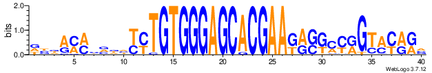
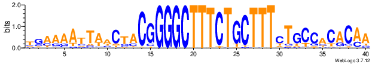

# Generate conserved target sites of IS1111 and IS110 family of insertion sequences

## Overview 

Insertion sequences (IS) transpose into genomes in a sequence specific manner. This repository contains a collection of scripts to find the target sites where the IS transposes into. This workflow is implemented in the Linux/Unix command-line environment.

A multi-fasta containing all query IS sequences is first searched against the bacterial and archaeal sequences within the NCB non-redundant nucleotide database using `blastn` from the `BLAST+` package. The BLAST output is then filtered for E value 0 and minimum sequence identity 95%. The `blastdbcmd` tool is then used to extract 200 bp of flanking seqeunce from either side of the insertion sequence. All sequences including exact duplicates are retained in a multi-fasta of insertion flanks per IS. From the 400 bp concatenated flank fastas, 20 bp flanks are extracted, taking care to ensure that the junction of the left and right flank is preserved in the centre of the 40 bp output sequence. These fastas are then processed with `WebLogo` to identify a conserved target site. The resultant image files can then be viewed to identify insertion sequence recognition sequences.

The workflow here focuses on IS family IS110 and IS1111. We describe the creation of a multi-fasta for these families from the [ISFinder](https://isfinder.biotoul.fr/) database and include relevant inputs and outputs. 
Given ISFinder annotated these two IS families as IS110 and its sub-group IS1111, we have named each fasta from IS110 family as IS_NAME_IS110_NA and named each fasta from IS1111 family as IS_NAME_IS110_IS1111. 
This workflow can be used for any IS family, by providing a multi-fasta as input and updating the scripts to reflect the prefix of your fasta. The relevant variable name within the scripts is `dataset` and can be updated manually or using `sed`.  

A demo/test dataset is provided with two IS, one from each of IS110 and IS1111 families. Results can be compared with ours published here to check the workflow before implementing on your dataset. 

## Compute requirements
The demo workflow has been tested on a Linux command-line environment. The full workflow was implemented on [NCI Gadi HPC](https://nci.org.au/our-systems/hpc-systems) running PBS Pro on CentOS. 

## Software dependencies
- BLAST+
- seqtk
- perl
- python
- python packages `biopython`, `bio`, `weblogo`

## Implementation

If you want to implement this workflow on your own IS multi-fasta, it is recommended to first run the demo workflow, to ensure it works on your compute platform. The demo workflow steps each take only a few seconds to run on the Linux command line.

<details>
<summary><b>Running the demo</b></summary>

#### Step 1. Run the BLAST against mini db

Notes: this script requires `blast+` module, it includes a `module load blast+` command.  If `blast+` is already in your path, you can delete/hash out this line, or edit to suit the requirements of your environment.  

Change into the base working directory `demo`, then run:

```
bash Scripts/blast_IS.pbs test
# Running two IS test
```

Output:
```
wc -l Output/IS_2sequence_demo.bacterial_archaeal.blast.out 
# 123 Output/IS_2sequence_demo.bacterial_archaeal.blast.out
```

123 unfiltered BLAST hits. The BLAST output contains no header by default. These are added to the filtered output produced at the next step. The column details are:

| Column | Header   | Description          |
|--------|----------|----------------------|
| 1      | qseqid   | Query sequence ID    |
| 2      | qlen     | Query length         |
| 3      | length   | Alignment length     |
| 4      | qstart   | Query start          |
| 5      | qend     | Query end            |
| 6      | sseqid   | Subject sequence ID  |
| 7      | stitle   | Subject title        |
| 8      | sacc     | Subject accession    |
| 9      | slen     | Subject length       |
| 10     | sstart   | Subject start        |
| 11     | send     | Subject end          |
| 12     | pident   | % identity           |
| 13     | mismatch | Number of mismatches |
| 14     | gapopen  | Number of gap opens  |
| 15     | evalue   | E value              |
| 16     | bitscore | Bit score            |

#### Step 2. Filter the BLAST for minimum identity 95% and E value 0

```
perl Scripts/filter_blast.pl
```

Output:
```
wc -l Output/IS_2sequence_demo_Ident95_E0.bacterial_archaeal.blast.filtered 
#122 Output/IS_2sequence_demo_Ident95_E0.bacterial_archaeal.blast.filtered
```

The filtered output contains headers. 121 of 123 BLAST hits passed filtering. This is summarised in the report file:

```
cat Output/IS_2sequence_demo_Ident95_E0.bacterial_archaeal.blast.report 
# #Sequence_ID    Family  Group   Raw_hits        Passing_hits
# ISPlge4 IS110   IS1111  67      67
# ISPsy35 IS110   NA      56      54
```
2 hits from ISPsy35_IS110 failed filtering.

#### Step 3. Create flank span/range lists for batch flank extraction

```
perl Scripts/extract_flank_ranges.pl
```

Output:
```
wc -l Output/Flanking_fastas_Ident95_E0/*
# 0 Output/Flanking_fastas_Ident95_E0/failing_flank_warnings.txt
# 121 Output/Flanking_fastas_Ident95_E0/left_flank_ranges.batch.txt
# 121 Output/Flanking_fastas_Ident95_E0/right_flank_ranges.batch.txt
```

All flank sequences were valid, ie there were no hits where the IS was inserted immediately to the left or right edge of the subject, which would produce a left or right flank size of 0 bp. The minimum left or right flank size is set at 1 bp. Filtering for minimum flank size is performed at step 6. This is to enable flexibility with the length of sequences used to generate WebLogos: steps 1 through 5 need only be performed once per dataset, and steps 6-7 can be performed repeatedly using different lengths. Re-running from step 2 with different BLAST filtering parameters is also an option by editing the filter parameters and `filter_name` variable in `filter_blast.pl`. Output is not overwritten when the workflow is re-run with different parameters, as the `filter_name` at step 2 and `flank_size` at step 6 are used to create private output directories. 


#### Step 4. Extract 200 bp flanking sequence for hits in filtered BLAST output

Notes: like step 1, this script requires `blast+` module, to run the utility `blastdbcmd`. The script includes a `module load blast+` command.  If `blast+` is already in your path, you can delete/hash out this line, or edit to suit the requirements of your environment.

```
bash Scripts/extract_flanks_submit.sh test
# Running 2 IS demo: creating left flanks
# Running 2 IS demo: creating right flanks
```

Output:
```
wc -l Output/Flanking_fastas_Ident95_E0/*fasta
# 242 Output/Flanking_fastas_Ident95_E0/left_flanks.fasta
# 242 Output/Flanking_fastas_Ident95_E0/right_flanks.fasta
```

#### Step 5. Concatenate the flanks into one multi-fasta per IS
```
perl Scripts/extracted_flanks_postprocess.pl
```

Output:
```
wc -l Output/Flanking_fastas_Ident95_E0/200bp_flanks/*
# 134 Output/Flanking_fastas_Ident95_E0/200bp_flanks/ISPlge4_IS110_IS1111_200bp_flanks.fasta
# 108 Output/Flanking_fastas_Ident95_E0/200bp_flanks/ISPsy35_IS110_unknown_200bp_flanks.fasta
```

All flanking sequences are now concatenated left+right into one multi-fasta per IS. Sequences that have been reverse-complimented have 'RC' in the fasta header. 


#### Step 6. Extract smaller flanks of desired length for WebLogo generation

Provide desired flank length as first and only command line argument. Flanks failing the size filter will be printed to a list file in the output directory. 

The specified value must be an integer less than 200. Example below restricts the flanks to 20 bp each side, so the output sequences are 40 bp in length:

```
perl Scripts/extract_shorter_flanks.pl 20
# Total input sequences: 121
# Total 2 x 20 bp output flank sequences: 121
# Total failing input length filter of 40 bp: 0
# Total failing output length filter of 40 bp: 0

# Failed sequence headers are written to file ./Output/Flanking_fastas_Ident95_E0/20bp_flanks/target_length_failed.txt

# New 40 bp fastas are written to directory ./Output/Flanking_fastas_Ident95_E0/20bp_flanks
```

#### Step 7. Create WebLogo sequence conservation images

This step requires `biopython`, `bio` and `weblogo` python packages. If you do not have these installed, run:

```
module load python3
pip install biopython
pip install bio
pip install weblogo
```

Provide the directory containing the fasta you wish to create WebLogos for as a command-line argument to the script. 

Note that this script requires all input sequences per IS are of equal length. The downstream script `extract_shorter_flanks.pl` applied at step 6 ensures this. This means it will not run directly on the output of step 5, where flanks may be between 1 bp and 200 bp. To create WebLogos on 200 bp flanks, run step 6 with the command-line argument '200'.

The `filter_name` and `flank_size` component of the input directory path are used to define the output directory path to ensure unique output filepaths for re-runs with different values. 

```
module load python3
python3 Scripts/weblogo_multipng.py Output/Flanking_fastas_Ident95_E0/20bp_flanks/
# Creating WebLogos on fastas in Output/Flanking_fastas_Ident95_E0/20bp_flanks/
# Writing WebLogos to Output/WebLogos/Ident95_E0_20bp_flanks
# Processing: ISPsy35_IS110_unknown_20bp_flanks.fasta
# Processing: ISPlge4_IS110_IS1111_20bp_flanks.fasta
```

Your generated output will be in `demo/Output`. The expected output is in `demo/expected_output`. 

The WebLogos for the 2 demo IS are shown below:



**Fig1.** ISPsy35_IS110 family conserved target sequence.  



**Fig2.** ISPlge4_IS1111 family conserved target sequence.

</details>

<details>
<summary><b>Running the workflow on full input</b></summary>

#### Preparing the multi-fasta
Required input for the workflow is a fasta containing at least one IS query seqeunce. 

We focused on IS from families IS110 and IS110-family sub-group IS1111. Since there is no URL for downloading multiple IS sequences from the [ISFinder database](https://isfinder.biotoul.fr/) (Siguier et al. 2006), we obtained IS110 and IS1111 family sequences from the 2020-Oct collection at [ISfinder-sequences]( https://github.com/thanhleviet/ISfinder-sequences) and manually added the IS sequences that were missing. 

The steps we used to do this are described below:

##### Obtain IS110 and IS1111 sequence IDs from ISFinder online database

- On the [ISFinder database](https://isfinder.biotoul.fr/) 'TOOLS' tab, select 'Search'. Under 'Family', select option 'equal_to' and enter 'IS110'. 
- Copy the table of 350 IS into a spreadsheet, and extract the first 3 columns ('Name', 'Family', 'Group'). 
- Export a tab-delimited text file `IS110_family_ID_list.txt-sorted`, sorted by IS ID, separating the IS ID, family and sub-group with underscore. For IS110 sequences not assigned to sub-group IS1111, use sub-group 'unknown'. 
- Upload `IS110_family_ID_list.txt-sorted` to working directory on Linux command-line environment.


##### Obtain IS110 and IS1111 fasta from ISfinder-seqeunces repository

- Clone the repository:

```
git clone https://github.com/thanhleviet/ISfinder-sequences.git
```

- Make a list of IS110 and IS1111 IDs included in this repository:

```
awk '$1~/^>/' ./ISfinder-sequences/IS.fna | sed 's/^>//' | grep _IS110_ | cut -d '_' -f 1 > IS110_IDs_from_github.txt
```
- Extract IS110 and IS1111 sequences to multi-fasta using `seqtk`:

```
awk '$1~/^>/' ./ISfinder-sequences/IS.fna | grep _IS110_ | sed 's/^>//' > IS110_fastaHeaders_from_github.txt
module load seqtk/1.3
seqtk subseq ./ISfinder-sequences/IS.fna IS110_fastaHeaders_from_github.txt > IS110_from_Github.fasta
```

##### Manually supplement missing sequences

- Find the sequences present on [ISFinder database](https://isfinder.biotoul.fr/) and missing from [ISfinder-sequences]( https://github.com/thanhleviet/ISfinder-sequences):

```
comm -13 IS110_IDs_from_github.txt-sorted IS110_family_ID_list.txt-sorted > IS110_missing_IDs.txt
```

- For each IS in `IS110_missing_IDs.txt`, manually obtain the fasta from [ISFinder database](https://isfinder.biotoul.fr/) and save as a multi-fasta. Ensure that the fasta headers for each sequence are compatible by changing them to the format `IS-ID_family_subgroup` eg `IS1328_IS110_IS1111` for a sequence in the IS1111 sub-group and `IS1000A_IS110_unknown` for a sequence not belonging to the IS1111 sub-group of IS110. 

- Combine the manually obtained fasta with those sequences derived from [ISfinder-sequences]( https://github.com/thanhleviet/ISfinder-sequences):

```
cat IS110_from_Github.fasta IS110_extra_from_web.fasta  > IS110_complete.fasta
```

The scripts in this workflow contain a variable `dataset` that is set by default to `IS110_complete`. This can be changed to the prefix of your input fasta as required. Ensure to delete or rename the existing `Input` and `Output` directories before executing the workflow with your own custom input fasta. 


#### Step 1. Run BLAST

Note: this workflow requires `blast+` module. The scripts at steps 1 and 4 include the command `module load blast+/2.13.0`. Please adjust this as required to reflect the setup of your compute environment. 

- Obtain bacterial and archaeal taxonimic IDs:

```
mkdir -p Input
module load blast+/2.13.0
sh get_species_taxids.sh -t 2 > Input/bacterial.taxids
sh get_species_taxids.sh -t  2157 > Input/bacterial_archaeal.taxids
cat Input/bacterial.taxids Input/archaeal.taxids > Input/bacterial_archaeal.taxids
rm Input/bacterial.taxids Input/archaeal.taxids
```

- BLAST IS sequences against non-redundant nucleotide database restricted to bacterial and archaeal taxonomic IDs

**Note on execution:** this script is written as a PBS script for submission to compute nodes on a HPC. Please adjust this as required to reflect the setup of your compute environment. 

**Note on BLAST database:** we used BLAST pre-formatted non-redundant nucleotide database version date 2024-02-19. Scripts at steps 1 and 4 contain a variable path `nt` that points to this database. Please adjust this as required to reflect your database filepath.

**Note on compute resources:** our BLAST job was exected on one 2 x 14-core Intel Xeon E5-2690v4 (Broadwell) 2.6GHz node with 256 GB RAM. Walltime used was 21.5 minutes and RAM used was 94 GB. 

```
mkdir -p PBS_logs
qsub Scripts/blast_IS.pbs
```

Output:
```
wc -l Output/IS110_complete.bacterial_archaeal.blast.out 
# 194326 Output/IS110_complete.bacterial_archaeal.blast.out
```

194,326 unfiltered BLAST hits. The BLAST output contains no header by default. These are added to the filtered output produced at the next step. The column details are:

| Column | Header   | Description          |
|--------|----------|----------------------|
| 1      | qseqid   | Query sequence ID    |
| 2      | qlen     | Query length         |
| 3      | length   | Alignment length     |
| 4      | qstart   | Query start          |
| 5      | qend     | Query end            |
| 6      | sseqid   | Subject sequence ID  |
| 7      | stitle   | Subject title        |
| 8      | sacc     | Subject accession    |
| 9      | slen     | Subject length       |
| 10     | sstart   | Subject start        |
| 11     | send     | Subject end          |
| 12     | pident   | % identity           |
| 13     | mismatch | Number of mismatches |
| 14     | gapopen  | Number of gap opens  |
| 15     | evalue   | E value              |
| 16     | bitscore | Bit score            |

#### Step 2. Filter the BLAST output

Default execution filters for a for minimum identity 95% and E value 0. To adjust this behaviour, edit `filter_blast.pl` to include your desired filter parameters. 

Editable variables are present within the script for `max_e_value`, `min_pc_ident`, `min_subject_length` and `max_subject_length`. 

Values applied for `max_e_value` and `min_pc_ident` are used to establish a variable `filter_name` which is used to name the output. 

Run the filter:

```
perl Scripts/filter_blast.pl
```

Output:
```
wc -l Output/IS110_complete_Ident95_E0.bacterial_archaeal.blast.*
# 35521 Output/IS110_complete_Ident95_E0.bacterial_archaeal.blast.filtered
# 350 Output/IS110_complete_Ident95_E0.bacterial_archaeal.blast.report
```

The filtered output contains headers. 35,520 BLAST hits passed filtering. This is summarised in the report file, which indicates the number of raw and passing hits per IS. 


#### Step 3. Create flank span/range lists for batch flank extraction

```
perl Scripts/extract_flank_ranges.pl
```

Output:
```
wc -l Output/Flanking_fastas_Ident95_E0/*
# 57 Output/Flanking_fastas_Ident95_E0/failing_flank_warnings.txt
# 35484 Output/Flanking_fastas_Ident95_E0/left_flank_ranges.batch.txt
# 35484 Output/Flanking_fastas_Ident95_E0/right_flank_ranges.batch.txt
```

The `failing_flank_warnings.txt` file contains a list of IS that were inserted immediately to the left or right edge of the subject, which would produce a left or right flank size of 0 bp. The minimum left or right flank size is set at 1 bp. Filtering for minimum flank size is performed at step 6. This is to enable flexibility with the length of sequences used to generate WebLogos: steps 1 through 5 need only be performed once per dataset, and steps 6-7 can be performed repeatedly using different lengths. Re-running from step 2 with different BLAST filtering parameters is also an option by editing the filter parameters and `filter_name` variable in `filter_blast.pl`. Output is not overwritten when the workflow is re-run with different parameters, as the `filter_name` at step 2 and `flank_size` at step 6 are used to create private output directories. 


#### Step 4. Extract 200 bp flanking sequence for hits in filtered BLAST output

Like step 1, this script requires `blast+` module, to run the utility `blastdbcmd`. The script includes a `module load blast+/2.13.0` command. Please adjust this as required to reflect the setup of your compute environment. 

**Note on execution:** this step is written as a PBS job for submission to compute nodes on a HPC. Please adjust this as required to reflect the setup of your compute environment. 

**Note on BLAST database:** we used BLAST pre-formatted non-redundant nucleotide database version date 2024-02-19. Scripts at steps 1 and 4 contain a variable path `nt` that points to this database. Please adjust this as required to reflect your database filepath.

**Note on compute resources:** our jobs were each exected on one CPU of a 2 x 24-core Intel Xeon Platinum 8268 (Cascade Lake) 2.9 GHz node with total RAM 1.5 TB, giving 32 GB RAM per CPU. Our jobs each used 10 minutes walltime and 29 GB RAM. 

Execute the 'submit' script, which will submit two PBS jobs, one each to extract the left and right flanks from the BLAST database using `blastdbcmd` utility: 

```
bash Scripts/extract_flanks_submit.sh
```

Output:
```
wc -l Output/Flanking_fastas_Ident95_E0/*fasta
# 70968 Output/Flanking_fastas_Ident95_E0/left_flanks.fasta
# 70968 Output/Flanking_fastas_Ident95_E0/right_flanks.fasta
```

These fastas contain left and right 200 bp flanking sequence for all passing BLAST hits. 

#### Step 5. Concatenate the flanks into one multi-fasta per IS

This step creates one multi-fasta per IS, containing the concatenated left and right 200 bp flanks as 400 bp sequences. Sequences that have been reverse-complimented have 'RC' in the fasta header. 


This step can be executed directly on your terminal or submitted to a cluster compute node if execution is too slow for terminal. Execution time on 1 CPU of a 2 x 24-core Intel Xeon Platinum 8274 (Cascade Lake) 3.2 GHz node was 1.7 minutes using < 1 GB RAM.

To execute directly on terminal:
```
perl Scripts/extracted_flanks_postprocess.pl
```

OR to submit to compute node: 
```
qsub Scripts/extracted_flanks_postprocess.pbs
```

Output:
```
ls -1 Output/Flanking_fastas_Ident95_E0/200bp_flanks/*200bp_flanks.fasta | wc -l
# 322
```

Note that there has been no filter for minimum number of flank sequences, ie some IS flank fasta may have only one sequence. Also note that some sequences may be less than 400 bp, as minimum flank size was 1 bp. 

#### Step 6. Extract smaller flanks of desired length for WebLogo generation

Provide desired flank length as first and only command line argument. Flanks failing the size filter will be printed to a list file in the output directory. 

The specified value must be an integer less than 200. We applied a flank size of 20 bp, so the output sequences are 40 bp in length:

```
perl Scripts/extract_shorter_flanks.pl 20
# Total input sequences: 35484
# Total 2 x 20 bp output flank sequences: 35459
# Total failing input length filter of 40 bp: 10
# Total failing output length filter of 40 bp: 15

# Failed sequence headers are written to file ./Output/Flanking_fastas_Ident95_E0/20bp_flanks/target_length_failed.txt

# New 40 bp fastas are written to directory ./Output/Flanking_fastas_Ident95_E0/20bp_flanks
```

#### Step 7. Create WebLogo sequence conservation images

This step requires `biopython`, `bio` and `weblogo` python packages. If you do not have these installed, run:

```
module load python3
pip install biopython
pip install bio
pip install weblogo
```

Provide the directory containing the fasta you wish to create WebLogos for as a command-line argument to the script. 

Note that this script requires all input sequences per IS are of equal length. The downstream script `extract_shorter_flanks.pl` applied at step 6 ensures this. This means it will not run directly on the output of step 5, where flanks may be between 1 bp and 200 bp. To create WebLogos on 200 bp flanks, run step 6 with the command-line argument '200'.

The `filter_name` and `flank_size` component of the input directory path are used to define the output directory path to ensure unique output filepaths for re-runs with different values. 

```
module load python3
python3 Scripts/weblogo_multipng.py Output/Flanking_fastas_Ident95_E0/20bp_flanks/
# Creating WebLogos on fastas in Output/Flanking_fastas_Ident95_E0/20bp_flanks/
# Writing WebLogos to Output/WebLogos/Ident95_E0_20bp_flanks
# Processing: ISSep2_IS110_unknown_20bp_flanks.fasta
# Processing: ISShdy1_IS110_IS1111_20bp_flanks.fasta
# Processing: ISMno29_IS110_unknown_20bp_flanks.fasta ...
```

The resulting image files can then be viewed to identify conserved insertion sequence target sites. 

Note that there has been no filter to avoid creating uninformative WebLogos from IS with only 1 flank fasta sequence. To avoid reviewing such images, you can create a list of IS by number of fastas used to generate the WebLogos with the following command:

```
for file in Output/Flanking_fastas_Ident95_E0/20bp_flanks/*fasta; do num=$(grep ">" $file | wc -l); id=$(basename $file); printf "$num\t$id\n"; done | sort -rnk1 > Output/Flanking_fastas_Ident95_E0/20bp_flanks/flanks_per_IS.txt
```

The output of this command will be a 2-column text file indicating the number of flank fastas per IS, sorted from highest number to lowest, eg:
```
head Output/Flanking_fastas_Ident95_E0/20bp_flanks/flanks_per_IS.txt 
# 7061    IS1663_IS110_unknown_20bp_flanks.fasta
# 1728    ISSfl4_IS110_unknown_20bp_flanks.fasta
# 1160    IS1533_IS110_IS1111_20bp_flanks.fasta
# 1144    ISKpn43_IS110_IS1111_20bp_flanks.fasta
# 1063    ISPa11_IS110_IS1111_20bp_flanks.fasta
# 1016    ISNgo2_IS110_unknown_20bp_flanks.fasta
# 920     IS621_IS110_unknown_20bp_flanks.fasta
# 899     IS4321_IS110_IS1111_20bp_flanks.fasta
# 899     IS4321L_IS110_IS1111_20bp_flanks.fasta
# 898     ISSep2_IS110_unknown_20bp_flanks.fasta
```

</details>
<br>

**Example output**

The WebLogos for the 2 demo IS are shown below:


**Fig1.** ISPsy35_IS110 conserved target sequence  


**Fig2.** ISPlge4_IS1111 conserved target sequence


## Citing this workflow

TBA

## References
- Siguier P et al. (2006) [ISfinder: the reference centre for bacterial insertion sequences](https://pubmed.ncbi.nlm.nih.gov/16381877/) Nucleic Acids Res. 34:D32-D36
- [ISFinder database](http://www-is.biotoul.fr)
- BLAST non-redundant nucleotide database: Sayers E et al. [Database resources of the National Center for Biotechnology Information](https://pubmed.ncbi.nlm.nih.gov/33095870/) Nucleic Acids Res. 49(D1):D10-D17
- Camacho C et al. (2008) [BLAST+: architecture and applications](https://pubmed.ncbi.nlm.nih.gov/20003500/) BMC Bioinformatics 10:421
- Crooks G et al. (2004) [WebLogo: a sequence logo generator](https://pubmed.ncbi.nlm.nih.gov/15173120/) Genome Res. 14(6):1188-90
- [seqtk](https://github.com/lh3/seqtk) 


## Acknowledgements
The authors acknowledge the technical assistance provided by the Sydney Informatics Hub, a Core Research Facility of the University of Sydney and the Australian BioCommons which is enabled by NCRIS via Bioplatforms Australia. The authors acknowledge the use of the National Computational Infrastructure (NCI) supported by the Australian Government and the Sydney Informatics Hub HPC Allocation Scheme, supported by the Deputy Vice-Chancellor (Research), University of Sydney and the ARC LIEF, 2019: Smith, Muller, Thornber et al., Sustaining and strengthening merit-based access to National Computational Infrastructure (LE190100021).


